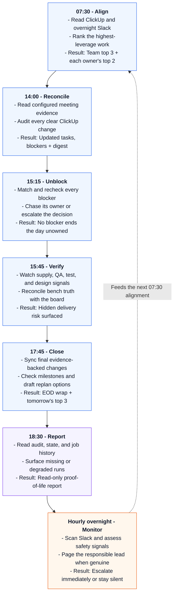

# Captain


Captain is an OpenClaw-based project manager for technical teams. It manages
ClickUp tasks, collects status updates in Slack, identifies critical paths, and
helps team members remove blockers. Captain can also identify tasks in meeting
transcripts sent to its configured email account.

## What Captain does

<table>
  <tr>
    <td width="50%" valign="top">
      🎯 <strong>Sets the day's priorities</strong><br>
      Turns ClickUp, Slack, and critical-path context into a focused morning brief.
    </td>
    <td width="50%" valign="top">
      👤 <strong>Gives everyone a personal top two</strong><br>
      Sends each owner the two highest-leverage tasks for their day.
    </td>
  </tr>
  <tr>
    <td width="50%" valign="top">
      🚧 <strong>Drives blockers to resolution</strong><br>
      Finds stuck work, follows up with the right owner, and escalates unresolved risks.
    </td>
    <td width="50%" valign="top">
      ✅ <strong>Keeps ClickUp honest</strong><br>
      Creates and updates tasks only when the evidence is clear, and audits every write.
    </td>
  </tr>
  <tr>
    <td width="50%" valign="top">
      📡 <strong>Surfaces delivery risk</strong><br>
      Watches project signals, bench results, dependencies, and milestone health.
    </td>
    <td width="50%" valign="top">
      🛟 <strong>Rolls out safely</strong><br>
      Moves from <code>off</code> to <code>shadow</code> to <code>live</code>
      with visible action reporting.
    </td>
  </tr>
</table>

## A day with Captain

<p align="center">
  <strong>07:30 Align</strong> →
  <strong>14:00 Reconcile</strong> →
  <strong>15:15 Unblock</strong> →
  <strong>15:45 Verify</strong> →
  <strong>17:45 Close</strong>
</p>



## Install Captain

Captain is packaged as an OpenClaw Claw. Claws are still experimental, so this
guide uses the exact OpenClaw version tested with Captain. The installation adds
one Captain agent and six scheduled jobs. Captain starts with `DailyLoop` off,
and its heartbeat starts disabled at `0m`. Complete the installation checks
before you start shadow mode.

### Before you begin

- Python 3
- A ClickUp application programming interface (API) key and ClickUp team ID
- A Slack account dedicated to Captain, plus the user and channel IDs used in
  `data/captain-channels.json`
- The `gog` Google CLI

On macOS or Linux, install `gog` with Homebrew:

```bash
brew install openclaw/tap/gogcli
gog --version
```

For Windows, Docker, or a source build, follow the
[`gog` installation guide](https://gogcli.sh/install.html). You connect `gog`
to Captain's Google account in the Configure meeting ingestion section.

### Install and verify OpenClaw

Captain currently supports OpenClaw `2026.7.2-beta.5`. Install that exact
version on macOS, Linux, or Windows Subsystem for Linux (WSL):

```bash
curl -fsSL https://openclaw.ai/install.sh | bash -s -- \
  --install-method npm \
  --version 2026.7.2-beta.5 \
  --no-onboard \
  --verify

openclaw onboard --install-daemon
```

If OpenClaw is already installed, do not reinstall it. Verify the version and
Gateway instead:

```bash
openclaw --version
openclaw gateway status
```

Continue only when the version contains `2026.7.2-beta.5` and the Gateway is
running. Keep the Gateway running while OpenClaw installs the Claw because the
Gateway owns OpenClaw's scheduler.

### Clone Captain

Clone this repository outside your OpenClaw state folder:

```bash
mkdir -p ~/src
git clone https://github.com/Common-Vector-Robotics/captain.git ~/src/captain
cd ~/src/captain
```

### Configure the scheduled-job time zone

Choose the Internet Assigned Numbers Authority (IANA) time zone that your team
uses for Captain's schedule. Replace `America/Detroit` with your team's time
zone. The commands update all six cron declarations and then verify the
resulting manifest:

```bash
CAPTAIN_TIME_ZONE=America/Detroit
python3 scripts/configure_timezone.py --timezone "$CAPTAIN_TIME_ZONE"
python3 scripts/configure_timezone.py --timezone "$CAPTAIN_TIME_ZONE" --check
```

If the time zone is invalid or `CLAW.md` doesn't contain exactly six Captain
jobs, the command stops without changing the file. The configuration command
changes your local `CLAW.md`; inspect and install that exact local manifest in
the next step.

### Inspect and install the Claw

From the cloned package directory, enable the experimental Claw commands,
inspect the package, and preview the installation. Keep the Gateway running:

```bash
export OPENCLAW_EXPERIMENTAL_CLAWS=1
openclaw claws inspect .
openclaw claws add . --dry-run --json
```

Review every action in the dry-run output and copy its `planIntegrity` value.
Replace `SHA256_FROM_DRY_RUN` below with that value, then apply the exact plan:

```bash
openclaw claws add . --yes --plan-integrity SHA256_FROM_DRY_RUN
```

`--yes` alone is intentionally insufficient. OpenClaw rejects the installation
if the package, destination, or live configuration changed after the dry run.

Confirm the installed agent and note the workspace path reported by OpenClaw:

```bash
openclaw claws status captain --json
```

The default workspace is `~/.openclaw/workspace-captain`. If the installation
plan reported a different path, use that path in the remaining commands.

At this point the agent and its six scheduler entries exist, but Captain is not
ready to operate. A missing mode file means `off`, and the heartbeat remains
disabled at `0m`. Continue with the private setup below.

### Configure ClickUp

Move into Captain's installed workspace. If OpenClaw reported a different path
in the previous section, use that path instead:

```bash
cd ~/.openclaw/workspace-captain
```

Create a local secrets file there without committing it:

```bash
mkdir -p .secrets
chmod 700 .secrets
cat > .secrets/clickup.env <<'EOF'
CLICKUP_API_KEY=YOUR_CLICKUP_API_KEY
CLICKUP_TEAM_ID=YOUR_CLICKUP_TEAM_ID
EOF
chmod 600 .secrets/clickup.env
```

Replace `YOUR_CLICKUP_API_KEY` and `YOUR_CLICKUP_TEAM_ID` with your ClickUp
credentials before you continue.

Verify the credentials with a read-only board fetch:

```bash
python3 scripts/fetch_clickup_tasks.py --out /tmp/captain-clickup-smoke.json
```

### Configure meeting ingestion

Captain supports Gemini meeting-note emails in Gmail. Their links open the
Notes and Transcript sections in Google Docs. Copy the example, and then
replace the sample account and meeting-title patterns with values for your
team:

```bash
cd ~/.openclaw/workspace-captain
cp data/meeting-ingestion.example.json data/meeting-ingestion.json
nano data/meeting-ingestion.json
python3 -m json.tool data/meeting-ingestion.json >/dev/null
```

The configured `google_cli` defaults to `gog`. Choose the setup that matches the
computer running Captain.

#### Desktop computer

On a computer with a desktop session and an unlocked login keychain,
authenticate `google_account` with only the Gmail, Drive, and Docs read scopes
that Captain needs:

```bash
gog auth add captain@example.com \
  --services gmail,drive,docs \
  --readonly \
  --drive-scope readonly
```

Then validate the login and its stored scopes:

```bash
gog auth list --check --account captain@example.com --no-input --json
```

#### Server without a desktop

On a server without a desktop or unlocked login keychain, keep the file-keyring
password in Captain's private `.secrets` directory. From Captain's installed
workspace, create the keyring settings file:

```bash
mkdir -p .secrets
chmod 700 .secrets
nano .secrets/gog-keyring.env
```

Add these two lines. Replace `YOUR_GOG_KEYRING_PASSWORD` with a strong
password:

```text
GOG_KEYRING_BACKEND=file
GOG_KEYRING_PASSWORD=YOUR_GOG_KEYRING_PASSWORD
```

Protect the file so only your user account can read it:

```bash
chmod 600 .secrets/gog-keyring.env
```

Next, create a private wrapper that loads those settings before it runs `gog`:

```bash
nano .secrets/captain-gog
```

Paste this into the wrapper:

```sh
#!/bin/sh
set -a
. "$(dirname "$0")/gog-keyring.env"
set +a
exec gog "$@"
```

Make the wrapper executable, select the encrypted file keyring, and authenticate:

```bash
chmod 500 .secrets/captain-gog
./.secrets/captain-gog auth keyring file
./.secrets/captain-gog auth add captain@example.com \
  --services gmail,drive,docs --readonly --drive-scope readonly
./.secrets/captain-gog auth list --check \
  --account captain@example.com --no-input --json
```

Print the wrapper's absolute path:

```bash
python3 -c \
  'from pathlib import Path; print(Path(".secrets/captain-gog").resolve())'
```

Copy the printed path into the `google_cli` field in
`data/meeting-ingestion.json`. This keeps the keyring password available only to
Captain's Google commands instead of every process started by OpenClaw.

Confirm that the returned JSON contains exactly one record for
`captain@example.com`. The record must contain `valid: true` and exactly these
scopes:

- `email`
- `openid`
- `https://www.googleapis.com/auth/userinfo.email`
- `https://www.googleapis.com/auth/gmail.readonly`
- `https://www.googleapis.com/auth/drive.readonly`
- `https://www.googleapis.com/auth/documents.readonly`

If broader historical grants appear, remove the token with
`gog auth remove captain@example.com`. Then revoke the application's prior
grants in Google Account security and authenticate again.

Never commit `.secrets/gog-keyring.env`, type its password as a command-line
argument, or allow the password to appear in shell history or logs.

Do not put a password, OAuth token, or client secret in `meeting-ingestion.json`. The
scheduled job never starts an interactive OAuth flow. `sender`, `subject_prefixes`, and
`meeting_title_patterns` control discovery; `lookback_days` controls partial-note retries;
`local_summary_directory` may be a readable local directory or `null`.

The default reconciliation schedule is 14:00 on weekdays in
`America/Detroit`. Schedule it after Gemini produces the transcript. Use
`scripts/configure_timezone.py` to set its time zone together with the other
five jobs.

### Connect Captain to Slack

Captain requires a dedicated Slack app and bot. Follow the
[OpenClaw Slack setup guide](https://docs.openclaw.ai/channels/slack) to create
the app, configure its scopes and events, install the Slack plugin, and store
its tokens securely.

For Captain specifically:

- Name the OpenClaw Slack account `captain` (`channels.slack.accounts.captain`).
- Enable direct messages (DMs) so Captain can send owner check-ins and receive
  replies.
- Invite the bot to the program channel, shadow destination, reporting
  destination, and every channel Captain should monitor. Captain can see only
  channels that the bot has joined.

Recommended channels:

- `#captains-quarters`: The team-facing program channel for morning briefs,
  blocker and bench digests, end-of-day wraps, and incident threads. Use it as
  `program_channel`.
- `#dry-dock`: A private operator channel for shadow-mode previews and Captain's
  daily activity report. Use it as `shadow_recipient` and, unless you want a
  separate reporting channel, `activity_digest_channel`.
- Keep `"slack_account": "captain"` in `data/captain-channels.json` aligned with the
  OpenClaw account name. A mismatched account or missing channel membership can
  surface as a misleading `channel_not_found` error.
- The Claw-managed hourly heartbeat uses the same configured `captain` Slack
  binding for permitted incident routing.

Also invite Captain to the team's existing project and operations channels
that it should monitor. Those channels don't need Captain-specific names.

Verify the connection before configuring Captain's routing:

```bash
openclaw channels status --probe --json
```

### Configure Slack routing and operators

Copy the example, replace its placeholders, and validate the JSON:

```bash
cp data/captain-channels.example.json data/captain-channels.json
nano data/captain-channels.json
python3 -m json.tool data/captain-channels.json >/dev/null
```

Replace every placeholder in `data/captain-channels.json`, including the
`mode_toggle_users` name-to-Slack-ID mapping. That private mapping is the only
authorization for DailyLoop mode changes. Captain rejects a mode change from a
missing or invalid entry. Keep configured files local and do not commit credentials or live
routing details. `program_channel` accepts either the example `{name,id}` object
or a non-empty string. The object form gives shadow previews a readable `#name`
while preserving its exact `id` as the live delivery target; a string remains the
exact live target. The live `data/captain-modes.json` file is runtime state: it
is not installed from this package, remains off when absent, and is created by
the first authorized mode change.

### Bind the Slack account to Captain

Creating a Slack account and routing it to an agent are separate OpenClaw
operations. Bind the account named `captain` to the Captain agent:

```bash
openclaw agents bind \
  --agent captain \
  --bind slack:captain

openclaw gateway restart

openclaw agents bindings \
  --agent captain \
  --json
```

The output must contain one binding with `agentId` set to `captain`, `channel`
set to `slack`, and `accountId` set to `captain`.

### Install the heartbeat policy and check the installation

The heartbeat is still disabled. Install its safety policy without enabling it:

```bash
cd ~/.openclaw/workspace-captain
python3 scripts/install_heartbeat_policy.py
openclaw doctor
python3 scripts/check_install.py \
  --expect-mode off \
  --expect-heartbeat 0m
```

The checker uses read-only OpenClaw, Slack, Google, ClickUp, and local file
checks. It stops at the first problem and explains what to fix. Do not continue
until its last line is:

```text
[PASS] Captain is ready for shadow mode.
```

Run `python3 scripts/install_heartbeat_policy.py` again after every Claw update.
OpenClaw may describe Captain as locally modified because the verified policy
is stored on this machine. That is expected; do not remove it to clear the
status.

### Start in shadow mode

To start Captain in shadow mode, complete these steps:

1. Confirm that Captain starts in `off` mode:

   ```bash
   python3 scripts/captain_modes.py status
   ```

2. Replace `YOUR_SLACK_USER_ID` with an authorized Slack user ID, and set
   `DailyLoop` to `shadow`:

   ```bash
   python3 scripts/captain_modes.py dailyloop \
     --audience shadow \
     --user-id YOUR_SLACK_USER_ID \
     --source initial-setup
   ```

3. Verify the heartbeat policy, enable the hourly heartbeat, and restart the
   Gateway:

   ```bash
   python3 scripts/install_heartbeat_policy.py --enable
   openclaw gateway restart
   ```

4. Verify the shadow configuration:

   ```bash
   python3 scripts/check_install.py \
     --expect-mode shadow \
     --expect-heartbeat 60m
   ```

5. List all Captain jobs, including the disabled heartbeat:

   ```bash
   openclaw cron list --agent captain --all
   ```

#### Test every Captain workflow

The list contains six scheduled jobs plus the heartbeat. Copy each scheduled
job ID, and run the six jobs one at a time. Wait for one job to finish before
you start the next:

```bash
openclaw cron run CRON_JOB_ID \
  --wait \
  --wait-timeout 10m
```

Test these six names:

- `Captain daily morning cycle`
- `Captain meeting transcript reconciliation`
- `Captain daily blocker chase`
- `Captain daily bench truth and channel watch`
- `Captain daily EOD wrap`
- `Action summary reporting`

For each result, confirm:

- The job finishes successfully.
- Any Slack output uses the `captain` account.
- Operational previews go only to `shadow_recipient`.
- The meeting job uses the intended Google account.
- The job reads the intended ClickUp board.
- No ClickUp task changes occur.

Do not switch to live if any check fails.

## Switch to live mode

Live mode is optional. Complete this checklist first:

- [ ] The installation checker passes in shadow mode.
- [ ] All six scheduled jobs passed one at a time.
- [ ] The heartbeat didn't send messages or write data unexpectedly.
- [ ] Slack messages used the Captain account and correct destinations.
- [ ] The meeting job used the intended Google account.
- [ ] ClickUp remained unchanged during shadow tests.

After every check passes, replace `YOUR_SLACK_USER_ID` with an authorized Slack
user ID and enable live actions:

```bash
python3 scripts/captain_modes.py dailyloop \
  --audience live \
  --user-id YOUR_SLACK_USER_ID \
  --source shadow-approved
```

To stop operational actions later while keeping monitoring and the daily
read-only activity report:

```bash
python3 scripts/captain_modes.py dailyloop \
  --audience off \
  --user-id YOUR_SLACK_USER_ID \
  --source manual-stop
```

For a shorter checklist, see [Set up Captain](BOOTSTRAP.md).

The package intentionally excludes credentials, configured Slack and mailbox
routing, runtime state, ClickUp exports, audit logs, local reports, and raw
meeting content.

This repository contains Captain's source prompts, persona files, scripts, and
non-sensitive fixtures.

The repository excludes these files from Git:

- Secrets and environment files
- Local OpenClaw runtime state
- SQLite databases and mutable cron state
- Raw emails, transcripts, meeting summaries, screenshots, generated reports,
  and ClickUp exports
- Audit and approval queues that may contain live operational details

Runtime state remains on the Captain host unless explicitly exported through a reviewed process.

## Optional integrations

### Sentry telemetry

Sentry integration is optional. If you aren't using Sentry, skip this section.
Sentry uses a data source name (DSN) to identify the project that receives
events.

Captain can report script crashes, session-report server errors, and OpenClaw
cron job failures to a Sentry project.

Captain's scripts send an event to Sentry when they crash. The optional cron
bridge compares each OpenClaw job's error counter against the previous run and
reports newly failed jobs. You can run it manually or generate a host-specific
background service: `launchd` on macOS or a systemd user service and timer on
Linux.

Each bridge run also checks in with the `captain-openclaw-bridge` Sentry
monitor. A missed check-in means that the host, OpenClaw, or the bridge might
be unavailable.

Without `.secrets/sentry.env`, Captain doesn't send telemetry. From the Captain
workspace, normally `~/.openclaw/workspace-captain`, complete the following
procedures.

#### Add your Sentry DSN

Create the settings file. It is never committed:

```bash
mkdir -p .secrets
chmod 700 .secrets
cat > .secrets/sentry.env <<'EOF'
SENTRY_DSN=YOUR_SENTRY_DSN
# Optional. The default is captain-host.
# SENTRY_ENVIRONMENT=captain-host
EOF
chmod 600 .secrets/sentry.env
```

Replace `YOUR_SENTRY_DSN` with the DSN for your Sentry project.

Telemetry needs the optional `sentry-sdk` package. Install it now:

```bash
python3 -m pip install --user -r requirements.txt
```

If Homebrew Python reports `error: externally-managed-environment`, rerun the
command with `--break-system-packages` after `--user`.

#### Confirm that events reach Sentry

Send one test event:

```bash
python3 scripts/captain_telemetry.py --self-test
```

The command returns `{"ok": true, "sent": true}`. Within a minute, Sentry
receives a `captain-telemetry self-test` event. After you confirm the event,
resolve it.

If the output is `{"ok": false, "error": "telemetry inactive ..."}`, check
these causes in order:

1. `SENTRY_DSN` is missing or empty.
2. `sentry-sdk` isn't installed for this Python interpreter.
3. `CAPTAIN_SENTRY_DISABLED=1` is set in the environment.

#### Preview the cron-failure bridge

See what the bridge would report before it can send anything:

```bash
python3 scripts/openclaw_cron_sentry_bridge.py --dry-run
```

The output must show `jobs` greater than `0`, an empty `counters_missing` list,
and `truncated` set to `false`:

```json
{
  "ok": true,
  "dry_run": true,
  "jobs": 27,
  "would_report": [],
  "counters_missing": [],
  "truncated": false
}
```

If `truncated` is `true`, OpenClaw returned only the first page of its job list.
The bridge can't monitor jobs on later pages. It also reports this condition to
Sentry because `openclaw cron list --json` doesn't support pagination.

If every job appears in `counters_missing`, OpenClaw's field names don't match
the fields that `job_view()` reads. Fix the field mapping before you rely on
the bridge:

```bash
openclaw cron list --json |
  jq '.jobs[] | {
    name,
    top_level_keys: keys,
    state_keys: (.state // {} | keys),
    state: .state
  }'

nano scripts/openclaw_cron_sentry_bridge.py
python3 -m pytest tests/test_openclaw_cron_sentry_bridge.py -v
python3 scripts/openclaw_cron_sentry_bridge.py --dry-run
```

#### Run cron monitoring automatically

Optional: Complete this procedure if you want Captain to check its scheduled
OpenClaw jobs every 10 minutes and report new failures to Sentry. Skip it if
you want only individual Captain scripts to report their own crashes.

The renderer creates the appropriate service files for macOS or Linux. It
doesn't start the service.

##### macOS

On macOS, create and load the `launchd` service:

```bash
mkdir -p logs
PLIST_PATH="$HOME/Library/LaunchAgents/ai.openclaw.captain-sentry-bridge.plist"
python3 scripts/render_sentry_service.py \
  --workspace "$PWD" \
  --output "$PLIST_PATH"
launchctl bootout "gui/$(id -u)" "$PLIST_PATH" 2>/dev/null || true
launchctl bootstrap "gui/$(id -u)" "$PLIST_PATH"
```

The generated `ai.openclaw.captain-sentry-bridge.plist` runs immediately and
every 10 minutes. To stop the service:

```bash
launchctl bootout "gui/$(id -u)" \
  "$HOME/Library/LaunchAgents/ai.openclaw.captain-sentry-bridge.plist"
```

##### Linux

On Linux, create and start the systemd user timer:

```bash
UNIT_DIR="$HOME/.config/systemd/user"
python3 scripts/render_sentry_service.py \
  --workspace "$PWD" \
  --output "$UNIT_DIR"

systemctl --user daemon-reload
systemctl --user enable --now ai.openclaw.captain-sentry-bridge.timer
```

The timer runs the bridge immediately and then 10 minutes after each completed
run. Inspect it with `journalctl --user -u ai.openclaw.captain-sentry-bridge`.
To stop the timer:

```bash
systemctl --user disable --now ai.openclaw.captain-sentry-bridge.timer
```

#### Turn off telemetry

To turn off Sentry for all Captain processes, rename the settings file:

```bash
mv .secrets/sentry.env .secrets/sentry.env.disabled
```

Without `.secrets/sentry.env`, Captain continues working normally but sends no
Sentry events or monitor check-ins.

To turn Sentry back on:

```bash
mv .secrets/sentry.env.disabled .secrets/sentry.env
```

For a single manual command, you can temporarily disable telemetry like this:

```bash
CAPTAIN_SENTRY_DISABLED=1 \
  python3 scripts/openclaw_cron_sentry_bridge.py --dry-run
```

`CAPTAIN_SENTRY_DISABLED` is a process environment variable. Do not add it to
`.secrets/sentry.env`; that file currently accepts only `SENTRY_DSN` and
`SENTRY_ENVIRONMENT`.

For telemetry rules, see [Captain tool reference](TOOLS.md).
