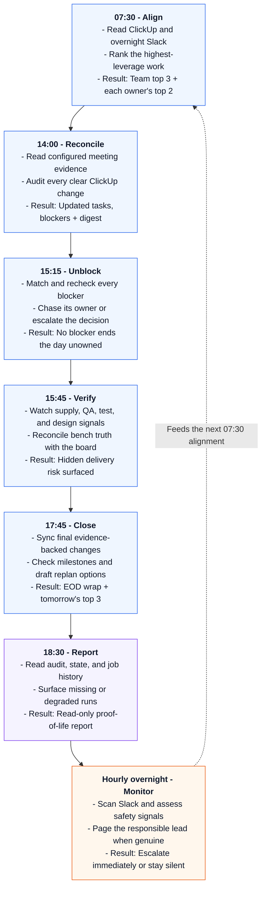

# Captain


Captain is an openclaw-based project manager for technical teams. Captain automatically manages Clickup tasks, checks in with team members over Slack to receive status updates, infers critical paths, and coordinates team members to remove blockers and prioritize important tasks. Captain also reads and infers tasks based on meeting transcripts sent to his configured email address.

## What Captain does

<table>
  <tr>
    <td width="50%" valign="top">
      🎯 <strong>Sets the day's priorities</strong><br>
      Turns ClickUp, Slack, and critical-path context into a focused morning brief.
    </td>
    <td width="50%" valign="top">
      👤 <strong>Gives everyone a personal top two</strong><br>
      Sends each owner the two highest-leverage tasks for their day.
    </td>
  </tr>
  <tr>
    <td width="50%" valign="top">
      🚧 <strong>Drives blockers to resolution</strong><br>
      Finds stuck work, follows up with the right owner, and escalates unresolved risks.
    </td>
    <td width="50%" valign="top">
      ✅ <strong>Keeps ClickUp honest</strong><br>
      Creates and updates tasks only when the evidence is clear—and audits every write.
    </td>
  </tr>
  <tr>
    <td width="50%" valign="top">
      📡 <strong>Surfaces delivery risk</strong><br>
      Watches project signals, bench results, dependencies, and milestone health.
    </td>
    <td width="50%" valign="top">
      🛟 <strong>Rolls out safely</strong><br>
      Moves from <code>off</code> to <code>shadow</code> to <code>live</code> with visible action reporting.
    </td>
  </tr>
</table>

## A day with Captain

<p align="center">
  <strong>07:30 Align</strong> →
  <strong>14:00 Reconcile</strong> →
  <strong>15:15 Unblock</strong> →
  <strong>15:45 Verify</strong> →
  <strong>17:45 Close</strong>
</p>



## Install and set up

Captain is packaged as an OpenClaw Claw (note: `.claw` packages are still experimental). It installs Captain as a new agent with five weekday operational jobs plus daily reporting in every `DailyLoop` mode, including `off`. The five operational jobs remain off until you configure them locally.

### Prerequisites

- A working [OpenClaw installation](https://docs.openclaw.ai/) with its Gateway and Slack channel configured
- Python 3
- A ClickUp API key and ClickUp team ID
- A Slack account dedicated to Captain, plus the user and channel IDs used in `data/captain-channels.json`
- The `gog` Google CLI, authenticated to a Gmail account with Gmail, Drive, and Docs access

### 1. Install the Claw

Clone this repository outside of your openclaw folder:

```Shell
# Make a directory (or choose your own)
mkdir -p ~/src

# Clone captain repository
cd ~/src
git clone <repository-url> captain

# Change wd to captain's folder
cd captain
```

Run these commands from this package directory (the directory containing `CLAW.md`). Before installing, set `AUTHORIZED_TOGGLE_USERS` to the Slack user IDs and names allowed to switch Captain between `off`, `shadow`, and `live`:

```bash
# Set authorized users in captain_modes.py (Slack User IDs)
nano scripts/captain_modes.py
```

Then inspect and preview the package:

```bash
# Enable OpenClaw's experimental Claw commands in this terminal.
export OPENCLAW_EXPERIMENTAL_CLAWS=1

# Check the package contents and install settings.
openclaw claws inspect .

# Preview the installation without changing your system.
openclaw claws add . --dry-run --json
```

Review every action in the dry-run output and copy its `planIntegrity` value.
Replace `SHA256_FROM_DRY_RUN` below with that value, then apply the exact plan:

```bash
# Install the exact package plan you just reviewed.
openclaw claws add . --yes --plan-integrity SHA256_FROM_DRY_RUN
```

`--yes` alone is intentionally insufficient. OpenClaw rejects the install if the package, destination, or live configuration changed after the dry run.

Confirm the installed agent and note the workspace path reported by OpenClaw:

```bash
# Confirm that Captain was installed and find its workspace path.
openclaw claws status captain --json

# Check the rest of your OpenClaw setup for problems.
openclaw doctor
```

The default workspace is `~/.openclaw/workspace-captain`. If the install plan reported a different path, use that path in the remaining commands.

### 2. Install Python dependencies

```bash
# Move into Captain's installed workspace.
cd ~/.openclaw/workspace-captain

# Install the Python packages Captain needs.
python3 -m pip install --user -r requirements.txt
```

Homebrew-managed Python may reject that command with `error: externally-managed-environment`. In that case, install into its user site explicitly:

```bash
# Use this version only if Python reports an externally-managed-environment error.
python3 -m pip install --user --break-system-packages -r requirements.txt
```

### 3. Configure ClickUp

Create a local secrets file without committing it:

```bash
# Create a private folder for local secrets.
mkdir -p .secrets

# Make the folder accessible only to your user account.
chmod 700 .secrets

# Create the ClickUp credentials file. Replace both placeholder values.
cat > .secrets/clickup.env <<'EOF'
CLICKUP_API_KEY=replace-with-your-clickup-api-key
CLICKUP_TEAM_ID=replace-with-your-clickup-team-id
EOF

# Allow only your user account to read or edit the credentials file.
chmod 600 .secrets/clickup.env
```

Verify the credentials with a read-only board fetch:

```bash
# Test the ClickUp connection and save the results to a temporary file.
python3 scripts/fetch_clickup_tasks.py --out /tmp/captain-clickup-smoke.json
```

### 4. Configure meeting ingestion

Captain supports Gemini meeting-note emails in Gmail whose links open Notes and Transcript
sections in Google Docs. Copy the example, then replace the sample account and meeting-title
patterns with values for your team:

```bash
# Create the local ingestion configuration in Captain's installed workspace.
cd ~/.openclaw/workspace-captain
cp data/meeting-ingestion.example.json data/meeting-ingestion.json
nano data/meeting-ingestion.json

# Confirm that the configuration is valid JSON.
python3 -m json.tool data/meeting-ingestion.json >/dev/null
```

The configured `google_cli` defaults to `gog`. Authenticate `google_account` for Gmail,
Drive, and Docs using the command supported by your installed `gog` version; a typical
setup is:

```bash
gog auth add captain@example.com
```

Do not put a password, OAuth token, or client secret in `meeting-ingestion.json`. The
scheduled job never starts an interactive OAuth flow. `sender`, `subject_prefixes`, and
`meeting_title_patterns` control discovery; `lookback_days` controls partial-note retries;
`local_summary_directory` may be a readable local directory or `null`.

The default reconciliation schedule is 14:00 on weekdays in `America/Detroit`. It should
run after Gemini has produced the Transcript. To use another cadence or timezone, edit the
`meeting-transcript-reconciliation` entry in `CLAW.md` before inspecting and installing the
package.

### 5. Connect Captain to Slack

Captain requires a dedicated Slack app and bot. Follow the maintained [OpenClaw Slack setup guide](https://docs.openclaw.ai/channels/slack) to create the app, configure its scopes and events, install the Slack plugin, and store its tokens securely.

For Captain specifically:

- Name the OpenClaw Slack account `captain` (`channels.slack.accounts.captain`).
- Enable DMs so Captain can send owner check-ins and receive replies.
- Invite the bot to the program channel, shadow destination, reporting destination, and
  every channel Captain should monitor. Captain can only see channels the bot has joined.

Recommended channels:

- `#captains-quarters` — the team-facing program channel for morning briefs, blocker and
  bench digests, end-of-day wraps, and incident threads. Use it as `program_channel`.
- `#dry-dock` — a private operator channel for shadow-mode previews and Captain's daily
  activity report. Use it as `shadow_recipient` and, unless you want a separate reporting
  channel, `activity_digest_channel`.
- Keep `"slack_account": "captain"` in `data/captain-channels.json` aligned with the
  OpenClaw account name. A mismatched account or missing channel membership can surface as
  a misleading `channel_not_found` error.

Also invite Captain to the team's existing project and operations channels that it should
monitor; those channels do not need Captain-specific names.

Verify the connection before configuring Captain's routing:

```bash
# Confirm that OpenClaw can authenticate the Captain Slack account.
openclaw channels status --probe --json
```

### 6. Configure Slack routing and operators

```bash
# Copy the example Slack settings into a local configuration file.
cp data/captain-channels.example.json data/captain-channels.json

# Open the local configuration and replace its placeholder values.
nano data/captain-channels.json

# Check that the edited file contains valid JSON.
python3 -m json.tool data/captain-channels.json >/dev/null
```

Replace every placeholder in `data/captain-channels.json`. Keep configured files local and do not commit credentials or live routing details.

### 7. Validate in shadow mode

Confirm that Captain starts in `off`, then enable `shadow` using an authorized Slack user ID:

```bash
# Check Captain's current operating mode.
python3 scripts/captain_modes.py status

# Send test actions only to the configured shadow destination.
python3 scripts/captain_modes.py dailyloop \
  --audience shadow \
  --user-id U0123456789 \
  --source initial-setup

# List Captain's scheduled jobs and their IDs.
openclaw cron list --agent captain
```

To test ingestion immediately, copy the job ID shown for
`Captain meeting transcript reconciliation` and run it:

```bash
# Run the meeting reconciliation job now. Replace MEETING_CRON_JOB_ID.
openclaw cron run MEETING_CRON_JOB_ID \
  --wait \
  --wait-timeout 10m
```

Inspect the configured shadow destination. Confirm that the meeting job read both Transcript
and Notes, sent output only to `shadow_recipient`, used the intended Google account and
ClickUp board, and made no ClickUp changes. Then confirm the remaining Captain jobs use the
right Slack account, recipients, and program channel before enabling live actions:

```bash
# Enable Captain's real Slack and ClickUp actions after checking shadow mode.
python3 scripts/captain_modes.py dailyloop \
  --audience live \
  --user-id U0123456789 \
  --source initial-setup
```

To stop operational actions while keeping the daily read-only activity report:

```bash
# Stop Captain's operational actions while keeping its daily activity report.
python3 scripts/captain_modes.py dailyloop \
  --audience off \
  --user-id U0123456789 \
  --source manual-stop
```

See [`BOOTSTRAP.md`](BOOTSTRAP.md) for the setup checklist and safety model.

The package intentionally excludes credentials, configured Slack and mailbox routing,
runtime state, ClickUp exports, audit logs, local reports, and raw meeting content.

This repository contains Captain's source prompts, persona files, scripts, and non-sensitive fixtures.

Excluded from git by design:

- secrets and environment files
- local OpenClaw runtime state
- SQLite databases and mutable cron state
- raw emails, transcripts, meeting summaries, screenshots, generated reports, and ClickUp exports
- audit and approval queues that may contain live operational details

Runtime state remains on the Captain host unless explicitly exported through a reviewed process.

# Optional Extras

## Sentry telemetry

Captain can report hard failures — script crashes, session-report server errors, and OpenClaw cron job failures — to a Sentry project.

Captain's scripts send an event to Sentry when they crash. A cron bridge also runs every 10 minutes via launchd, comparing each OpenClaw job's error counter against the previous run, and reports jobs that newly failed. 

Each bridge run also checks in with the `captain-openclaw-bridge` Sentry monitor, which acts as a dead-man's switch: a missed check-in means the host, OpenClaw, or the bridge itself is down.

Without `.secrets/sentry.env`, every telemetry call is a silent no-op and Captain behaves exactly as it does today. Run these steps on the Captain host, from its workspace directory (`~/.openclaw/workspace-captain` by default).

### 1. Add your Sentry DSN

Create the settings file. It is never committed:

```bash
# Create the private secrets folder if it does not already exist.
mkdir -p .secrets

# Make the folder accessible only to your user account.
chmod 700 .secrets

# Create the Sentry settings file. Replace the DSN placeholder.
cat > .secrets/sentry.env <<'EOF'
SENTRY_DSN=<your project's Sentry DSN>
# SENTRY_ENVIRONMENT=captain-host   # optional, defaults to captain-host
EOF

# Allow only your user account to read or edit the settings file.
chmod 600 .secrets/sentry.env
```

Telemetry also needs the `sentry-sdk` package, which came from [step 2](#2-install-python-dependencies). If you skipped that step, run `python3 -m pip install --user -r requirements.txt` now, adding `--break-system-packages` if Python reports `error: externally-managed-environment`.

### 2. Confirm that events reach Sentry

```bash
# Send one test event to confirm the Sentry connection works.
python3 scripts/captain_telemetry.py --self-test
```

Expected output is `{"ok": true, "sent": true}`, followed within a minute by a `captain-telemetry self-test` event in your Sentry project. Resolve that event once you see it.

If the output is `{"ok": false, "error": "telemetry inactive ..."}`, one of three things is true: `SENTRY_DSN` is missing or empty, `sentry-sdk` is not installed for this Python, or `CAPTAIN_SENTRY_DISABLED=1` is set in the environment. All three are deliberate no-ops, so nothing else in the output will tell you which one it is — check them in that order.

### 3. Preview the cron-failure bridge

See what the bridge would report before it can send anything:

```bash
# Show what the bridge would report, without sending events or check-ins.
python3 scripts/openclaw_cron_sentry_bridge.py --dry-run
```

Expected output looks like this: `jobs` greater than 0, `counters_missing` empty, `truncated` false:

```json
{
  "ok": true,
  "dry_run": true,
  "jobs": 27,
  "would_report": [],
  "counters_missing": [],
  "truncated": false
}
```

If `truncated` is `true`, OpenClaw returned only the first page of its job list and the jobs beyond it are unmonitored. The bridge reports this to Sentry as a warning too, because `openclaw cron list --json` offers no way to page through the rest.

If every job is listed in `counters_missing`, OpenClaw's field names don't match what `job_view()` looks for, and the bridge will silently report zero failures forever while the dead-man's switch still says it's healthy. Fix the field mapping before loading the plist:

```bash
# Inspect the actual counter and error fields returned by OpenClaw.
openclaw cron list --json |
  jq '.jobs[] | {
    name,
    top_level_keys: keys,
    state_keys: (.state // {} | keys),
    state: .state
  }'

# Update job_view() to match the error fields returned by `openclaw cron list --json`.
nano scripts/openclaw_cron_sentry_bridge.py

# Re-verify.
python3 -m pytest tests/test_openclaw_cron_sentry_bridge.py -v
python3 scripts/openclaw_cron_sentry_bridge.py --dry-run
```

### 4. Check that launchd's Python can load the SDK

`launchd` may pick a different Python than your shell does, and the bridge continues silently when the SDK is missing — so it would look healthy while sending nothing at all. Confirm that `sentry-sdk` is installed for the exact interpreter the plist's `PATH` selects:

```bash
# Confirm that launchd's Python can import the Sentry package.
PATH=/opt/homebrew/bin:/usr/local/bin:/usr/bin:/bin /usr/bin/env python3 -c "import sentry_sdk; print(sentry_sdk.VERSION)"
```

A version number means you are set. If this fails with `ModuleNotFoundError`, install the dependencies for that specific interpreter:

```bash
# Install Captain's dependencies for the interpreter launchd will use.
PYTHON_PATH="$(PATH=/opt/homebrew/bin:/usr/local/bin:/usr/bin:/bin /usr/bin/env python3 -c 'import sys; print(sys.executable)')"
"$PYTHON_PATH" -m pip install --user -r requirements.txt
```

A virtualenv (`python3 -m venv .venv && .venv/bin/pip install -r requirements.txt`) works for running the scripts by hand, but the plist calls plain `python3` and will not find it. If you go that route, replace the `/usr/bin/env` and `python3` entries in the plist's `ProgramArguments` with the venv interpreter's absolute path before continuing.

### 5. Install the launchd service

`launchd/com.intermode.captain-sentry-bridge.plist` hardcodes `/Users/owen/.openclaw/workspace-captain` in three places: `WorkingDirectory`, `StandardOutPath`, and `StandardErrorPath`. If your workspace lives anywhere else, edit those three paths before copying the file in.

```bash
# Create the log folder the launchd service writes to.
mkdir -p logs

# Copy the launchd service file into your user account.
cp launchd/com.intermode.captain-sentry-bridge.plist ~/Library/LaunchAgents/

# Stop the old service if it is already loaded. No output is expected if it is not.
launchctl unload ~/Library/LaunchAgents/com.intermode.captain-sentry-bridge.plist 2>/dev/null

# Load the service so it runs every 10 minutes.
launchctl load ~/Library/LaunchAgents/com.intermode.captain-sentry-bridge.plist
```

### 6. Confirm the bridge is running

The service runs once immediately on load, so you can check the result right away:

```bash
# Confirm launchd loaded the service. The middle column is the last exit code.
launchctl list | grep com.intermode.captain-sentry-bridge

# Read the result of the most recent run.
tail -n 5 logs/sentry-bridge.out.log
tail -n 20 logs/sentry-bridge.err.log
```

Expect exit code `0` from `launchctl list` and a line like `{"ok": true, "jobs": 27, "new_failures": []}` in the out log, with the error log empty.

Two things look like breakage but are not:

- **The first run never reports failures.** It only records the current error counters as a baseline in `data/sentry-bridge-state.json`. Failure events start with the next run, 10 minutes later.
- **You do not create the Sentry monitor yourself.** `captain-openclaw-bridge` appears in Sentry's Crons dashboard on its own, because the bridge sends its schedule with the first check-in.

### Turning telemetry off

```bash
# Stop the scheduled bridge.
launchctl unload ~/Library/LaunchAgents/com.intermode.captain-sentry-bridge.plist
```

To silence all telemetry, delete `.secrets/sentry.env` or set `CAPTAIN_SENTRY_DISABLED=1`. Either one returns every telemetry call to being a no-op; nothing else about Captain changes.

See the Sentry section of [`TOOLS.md`](TOOLS.md) for the rules new Captain scripts must follow.
