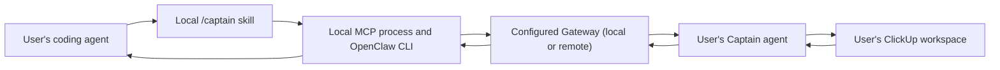

# Captain Agent Plugin Design

**Date:** 2026-08-17

**Status:** Ready for user review

## Objective

Add an open-source, user-operated agent plugin to Captain. The plugin lets an
MCP-capable coding agent report completed work to the user's own Captain agent
through a `/captain` skill.

The plugin is a complete product by itself. It uses the Gateway selected by the
user's OpenClaw CLI rather than implementing its own network transport.

## Source and Delivery

All product work targets `Common-Vector-Robotics/captain`. The feature branch
must start from a freshly fetched `origin/main`; private Captain repositories
may be read for compatibility evidence but are never the implementation or
release target.

The finished branch must be pushed and submitted as a pull request into
`Common-Vector-Robotics/captain` with `main` as its base. Immediately before PR
creation, fetch `origin/main` again, incorporate any new upstream commits, and
rerun the focused and full verification gates.

## Product Boundary

The user owns and operates every Captain component:



The coding agent, MCP server, and OpenClaw CLI run on the same machine. The
configured Gateway and Captain agent may run there or on a remote host. ClickUp
and the user's selected model provider remain user-configured dependencies.

## User Experience

1. The user installs and configures the public Captain Claw.
2. The user installs the `agent-plugin/` bundle and its Python requirements.
3. The user's MCP host launches the bundled server over `stdio` on demand.
4. When the user invokes `/captain`, the skill gathers readily available Git and
   verification evidence, removes sensitive or unrelated content, creates one
   safe report identifier, and calls the exact tool exposed by its host catalog:
   `Captain:captain_session_report` in Codex or
   `captain__captain_session_report` in OpenClaw. It never guesses or calls
   both names.
5. The MCP server passes the structured report to the local OpenClaw CLI. The
   CLI routes it through the configured Gateway to the `captain` agent and
   waits for its canonical response.
6. The skill renders the result, including any ClickUp changes, clarification
   questions, warnings, or uncertain outcome.

The plugin never asks the user to map work to ClickUp manually. Captain retains
that judgment and asks for clarification only when the evidence is genuinely
ambiguous.

## Repository Layout

The feature stays isolated from Captain's daily-loop implementation:

```text
.agents/plugins/marketplace.json
agent-plugin/
  .codex-plugin/plugin.json
  .mcp.json
  README.md
  requirements.txt
  bin/captain-agent-mcp
  captain_agent/
    __init__.py
    reporting.py
    server.py
  skills/captain/SKILL.md
tests/
  test_captain_agent_package.py
  test_captain_agent_reporting.py
```

`server.py` registers the MCP tool and owns only protocol translation.
`reporting.py` owns validation, local idempotency state, the OpenClaw subprocess,
and response normalization. Keeping those responsibilities separate allows the
reporting behavior to be tested without starting an MCP process.

The root `package.json` includes `agent-plugin/` in the published package. The
existing Claw manifest does not install or start the coding-agent plugin inside
Captain's own workspace.

## MCP Contract

The server exposes one mutating tool:

```text
captain_session_report(report_id, report, metadata) -> CaptainReportResult
```

### Input

- `report_id`: a 1-128 character identifier containing only ASCII letters,
  numbers, `.`, `_`, or `-`. The skill uses a matching host session identifier
  directly, derives `captain-<sha256>` without exposing the source when the
  identifier is unsafe, or uses a UUID when no host identifier exists. It
  reuses the safe result for every retry.
- `report`: the existing concise report shape: project, context, summary,
  changed files, verification, decisions, blockers, risks, and next steps.
- `metadata`: client name, repository, branch, timestamp, and an optional host
  session identifier.

The caller cannot supply authentication, authorization, identity, or claims
fields in either `report` or `metadata`, including nested or camelCase forms.
This is a single-user integration. Its execution boundary includes the MCP host
process, local OpenClaw CLI, and configured Gateway. Captain may use report
evidence to identify relevant work; it must ask for clarification rather than
guess when identity or task mapping matters.

### Output

Every tool result uses this structured shape:

```json
{
  "report_id": "...",
  "status": "created|updated|queued|needs_clarification|needs_configuration|partial|failed|unknown_outcome",
  "clickup_updates": [],
  "captain_feedback": "...",
  "questions": [],
  "warnings": []
}
```

`failed` means Captain definitively did not complete the handoff.
`unknown_outcome` means the local adapter dispatched the request but could not
prove whether Captain finished. The skill must not describe that state as a
failure or claim that ClickUp is unchanged.

## OpenClaw Adapter

The adapter invokes the supported CLI without a shell:

```text
openclaw agent --agent captain --session-id captain-report-<report_id> \
  --thinking high --timeout <seconds> --json --message-file -
```

The prompt is written to standard input so report content does not appear in a
shell command or process argument. The defaults are `openclaw`, `captain`,
`high`, and 300 seconds. `CAPTAIN_AGENT_OPENCLAW_COMMAND`, `CAPTAIN_AGENT_ID`,
`CAPTAIN_AGENT_THINKING`, and `CAPTAIN_AGENT_TIMEOUT_SECONDS` override those
values for nonstandard CLI installations.

The command omits `--local`, so OpenClaw routes the turn through the Gateway
selected by the CLI configuration. That Gateway may run locally or remotely;
the plugin does not need a separate Gateway URL option.

The adapter accepts direct canonical JSON and documented OpenClaw JSON result
envelopes. Invalid or non-zero responses are bounded before being returned in a
warning so large output and incidental sensitive content are not reflected back
unlimited.

## Idempotency and Local State

The MCP server stores report state in a small SQLite database at
`$XDG_STATE_HOME/captain-agent/reports.sqlite3`, falling back to
`~/.local/state/captain-agent/reports.sqlite3` when `XDG_STATE_HOME` is unset.
`CAPTAIN_AGENT_STATE_PATH` overrides the complete database path for tests and
nonstandard local installations.

- A new `report_id` is recorded before OpenClaw is invoked.
- Stored `created`, `updated`, `partial`, and `unknown_outcome` results are
  immutable replays and never start another OpenClaw turn.
- Stored `failed`, `needs_configuration`, `needs_clarification`, and `queued`
  results are retryable. A same-ID call transactionally changes the row back to
  `processing`, clears its result, refreshes the project and timestamp, and
  starts one new OpenClaw turn.
- A duplicate report still marked as processing returns `queued` without
  starting a second OpenClaw turn.
- A timeout or interrupted handoff is recorded as `unknown_outcome`; retrying
  the same identifier returns that safe result instead of risking a duplicate
  ClickUp write.

The database stores the report identifier, timestamps, project label, status,
and canonical result. It does not store access tokens or model credentials.
Captain continues to audit actual ClickUp writes in its own workspace.

## Security and Privacy

- Use MCP `stdio` only; do not implement Streamable HTTP, OAuth, or a bearer-token
  endpoint.
- Launch OpenClaw with an argument array and `shell=False`.
- Accept at most 1 MiB of serialized report and metadata content.
- Recursively reject reserved authentication, authorization, identity, and
  claims keys in both input objects; strip them from both again before prompt
  serialization as defense in depth.
- Reject missing summaries and malformed top-level fields before invoking
  OpenClaw.
- Tell the skill never to include secrets, credentialed URLs, customer PII,
  unrelated personal data, or raw transcript dumps.
- Keep response diagnostics short and never include the process environment.
- Create the SQLite state directory and database with user-only permissions
  where the operating system permits it.

## Packaging and Installation

The repository is a Codex marketplace whose `captain` entry points at the
Codex-format bundle under `agent-plugin/`. The bundle uses a relative local MCP
command and a portable `SKILL.md`. OpenClaw can consume the compatible bundle,
while other MCP hosts can point at the same launcher command manually. V1 does
not add separate host-specific implementations of the reporting logic.

The launcher uses `CAPTAIN_AGENT_PYTHON` when set, then
`agent-plugin/.venv/bin/python` when present, then a `python3` from `PATH` only
when `from mcp.server import MCPServer` works and
`importlib.metadata.version("mcp")` reports major version 2. When none of those
are ready, the launcher uses `uv run --no-project --with-requirements
requirements.txt` so dependencies are resolved and cached entirely on the
user's machine. The nested requirements pin the official SDK to `mcp>=2,<3`.
The launcher prints one actionable setup message when neither a ready Python
environment nor `uv` is available. The optional manual installation guide
creates `agent-plugin/.venv`, so global package mutation is unnecessary; the
repository ignores that directory.

The terminal-recipient prompt tells Captain to use its normal PM capabilities,
return the canonical JSON directly, and never invoke `/captain`, the `captain`
skill, or either reporting-tool name. OpenClaw setup also excludes `captain`
from the `id: "captain"` agent's skill allowlist and denies
`captain__captain_session_report` for that agent; deny wins over allow/profile
rules.

## Testing

Focused tests cover:

- plugin manifest, packaged-file, and relative-launch contracts;
- valid report forwarding and canonical structured output;
- missing summary and oversized input rejection;
- direct and nested OpenClaw JSON responses;
- non-zero exit, invalid JSON, timeout, and bounded diagnostics;
- same-ID replay without a second OpenClaw invocation;
- retryable same-ID reclaim and immutable replay categories;
- processing and uncertain duplicate behavior;
- nested identity/authorization rejection in both input objects;
- bounded and redacted unexpected-status diagnostics;
- process-start configuration failures versus post-dispatch uncertainty;
- an importable MCP 1.x system Python falling back to `uv`;
- command construction without a shell or report text in arguments;
- state-directory and database permissions where portable to assert;
- an in-process MCP client call using the official Python SDK.

Release verification includes the full Captain test suite plus an MCP Inspector
smoke test against the packaged launcher. A live OpenClaw/ClickUp write is
reported separately and is never implied by mocked tests.

## Non-Goals

- A plugin-owned network transport, hosting layer, OAuth flow, telemetry, or
  multi-user identity. Gateway connectivity remains OpenClaw's responsibility.
- A2A support, background workers, or a general agent-to-agent framework.
- Reimplementing Captain's ClickUp matching or PM judgment in the plugin.
- Automatic installation of OpenClaw, Captain, ClickUp credentials, or a model
  provider.
- Supporting multiple Captain backends before a real user need exists.

## Acceptance Criteria

The feature is complete when a clean installation can invoke `/captain`, call
the one bundled MCP tool over `stdio`, receive Captain's canonical result, and
safely replay the same report identifier without a second OpenClaw turn. All
new focused tests and the existing Captain suite must pass. Documentation must
distinguish the local MCP/CLI components from the local-or-remote Gateway. The
final reviewed changes must be pushed and opened as a pull request against
`Common-Vector-Robotics/captain:main`.
